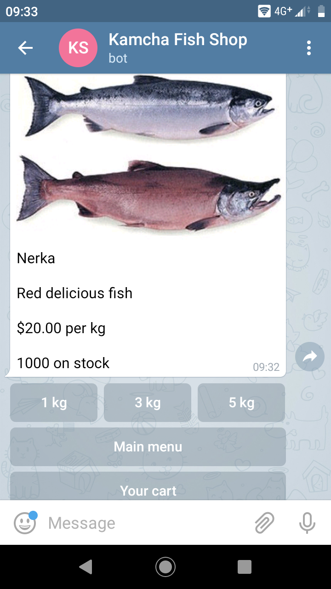

# Telegram E-Shop

This telegram bot is simple e-shop based on [Moltin API](https://moltin.com) and uses [state machine](https://en.wikipedia.org/wiki/Finite-state_machine) principles. Moltin CSM stores products, user cart and info. [Redis](https://redislabs.com/) DB stores current user statement.


## How to install

1. Python 3 and libraries from **requirements.txt** should be installed. Use virtual environment tool, for example **virtualenv**

```bash
virtualenv virtualenv_folder_name
source virtualenv_folder_name/bin/activate
python3 -m pip install -r requirements.txt
```

2. Create [Moltin account](https://dashboard.moltin.com), add new products with prices, stock levels and images. Get Moltin Client ID and Client secret.

3. Create new Telegram bot, get token and your ID.

4. Create [Redis](https://redislabs.com/) account, get host, port and password.

5. Put vulnerable parameters to **.env** file.

```
MOLTIN_CLIENT_ID=moltin_client_id
MOLTIN_CLIENT_SECRET=moltin_client_secret
TELEGRAM_TOKEN=telegram_telegram
TELEGRAM_CHAT_ID_ADMIN=telegram_chat_id_admin
REDIS_HOST=redis_host
REDIS_PORT=redis_port
REDIS_PWD=redis_pwd
```

## Quickstart

Run **main.py** and test your e-shop in Telegram.



## How to deploy

For example, you can deploy apps on [Heroku](https://heroku.com), with
GitHub integration.

1. Create app with GitHub deployment method.

2. Add vulnerable environment variables to Settings > Config Vars section.

3. Activate your Dyno in the "Resourses" section.

For reading logs install [Heroku CLI](https://devcenter.heroku.com/articles/heroku-cli#download-and-install) and log in.

```bash
$ heroku logs -a your-app-name
```

## Project Goals

The code is written for educational purposes on online-course for
web-developers [dvmn.org](https://dvmn.org/).
